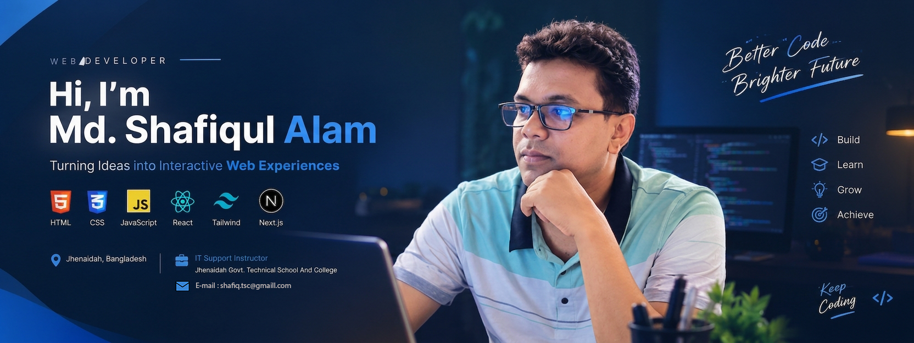

<div align="center">


<br>

# 👋 Hi, I'm Shafiq

### 💻 IT Support Instructor • Web Development Enthusiast • Future Remote Developer


[](https://github.com/)
[](https://www.linkedin.com/)
[](#)

</div>

---

## 🚀 About Me

I'm an **IT Support Instructor** at **Jhenaidah Government Technical School & College, Jhenaidah, Bangladesh**.

I enjoy learning modern web technologies and building practical projects. My current focus is becoming a strong **Web Developer** and eventually working in a **remote web development role**.

- 👨‍🏫 Teaching IT & technical subjects
- 🌐 Learning and building with modern web technologies
- ⚛️ Exploring React and Next.js
- 🧩 Improving my problem-solving and development skills
- 🌍 Interested in remote opportunities and real-world projects

---

## 🛠️ Tech Stack

<div align="center">

### Frontend


### Tools


</div>

---

## 📌 What I'm Working On

```text
Web Development
├── JavaScript
├── React
├── Next.js
├── Tailwind CSS
└── Real-world projects
```

My goal is to keep learning, build useful applications, and grow into a professional remote web developer.

---

## 📂 Featured Projects

| Project | Description | Technologies |
|---|---|---|
| 🌐 Web Projects | Responsive websites and UI experiments | HTML • CSS • JavaScript |
| ⚛️ React Projects | Component-based applications | React • JavaScript |
| ▲ Next.js Projects | Modern full-stack web applications | Next.js • React |
| 🎨 UI Experiments | Clean and responsive interfaces | Tailwind CSS |

> 💡 More projects are available in my GitHub repositories.

---


## 🎯 My Current Goals

- Build production-quality web applications
- Become highly confident with React & Next.js
- Improve JavaScript fundamentals
- Build a strong developer portfolio
- Contribute to real-world projects
- Prepare for remote web development opportunities

---

## 🤝 Let's Connect

<div align="center">

**I'm always interested in learning, building, and connecting with other developers.**

[](https://www.linkedin.com/)
[](https://github.com/)

<br><br>

### 💙 Keep Learning • Keep Building • Keep Growing

</div>
